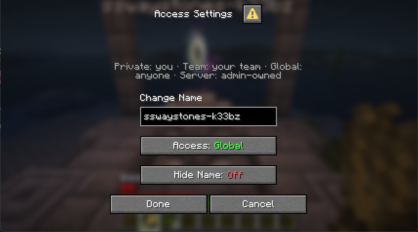

# Server-Side Waystones — k33bz fork

An independently maintained fork of [sylvxa/sswaystones](https://github.com/sylvxa/sswaystones), a Polymer-based, fully server-side Waystone mod for Fabric with vanilla-client and Bedrock (Geyser/Floodgate) support.

This fork is a **drop-in replacement**: same mod id, same save data, same config file, same permissions. Everything upstream does, this does — plus the features below. Upstream declined these changes ([PR #52](https://github.com/sylvxa/sswaystones/pull/52)), so they are developed and maintained here instead. Upstream fixes are merged in as they land.

## What this fork adds

- **Native settings dialog (opt-in).** Set `settings_ui` to `dialog` and the Java "Access Settings" button opens a single vanilla server dialog — name, access level, and hide-name in one form, mirroring the Bedrock experience. The default (`sgui`) keeps the classic chest menus untouched.

  

- **One Access selector.** Instead of three independent Global/Team/Server toggles, the dialog and the Bedrock form present one mutually-exclusive access mode (Private / Team / Global / Server-owned), permission-filtered, with the waystone's current mode always preserved on re-save. All changes are re-validated server-side — the UI can't be used to escalate permissions.
- **Hide Name toggle.** Hide a waystone's floating name hologram (especially useful against Bedrock clients, which can read it through walls). Available in all three settings UIs; saved as an optional field, so existing worlds load unchanged. Feature idea credit: [Hellscaped](https://github.com/sylvxa/sswaystones/pull/51).
- **Viewer polish.** Page arrows only appear when there is more than one page, entries carry "Left-click: Teleport / Right-click: Forget" hints, and forget-eligibility is properly guarded.
- **Admin debug commands.** `/waystonesettings testcreate | testopen <hash> | get <hash>` (admin-gated) mint, open, and inspect waystones deterministically — built for RCON-driven regression testing.
- **Unit tests + CI.** The extracted pure logic (access-mode mapping, argument parsing, pagination, forget rules, config parsing) is covered by JUnit tests that run in GitHub Actions on every push.

## Features (from upstream)

- Server-side Waystone blocks that allow you to teleport long distances and across dimensions.
- Feature-full GUIs for both Bedrock and Java players, using forms and chest GUIs respectively.
- Waystones can have up to 32 character long names and can be set to "global" to allow anybody on the server to use them.
- Works on both servers and singleplayer worlds; all storage data is held in the world itself.

## Recipes

*Recipe for the Waystone*

*Recipe for the Portable Waystone*

## Branches

| Branch | Minecraft | Status |
|---|---|---|
| `main` | 26.2 | Active development |
| `26.1` | 26.1 | Maintenance |
| `26.3` | 26.3 | Experimental (upstream deps not published yet) |

Jars are built by [GitHub Actions](../../actions) on every push.

## Configuration

The file is saved in `config/sswaystones.json`, and can be edited either manually or by commands.

- `/sswaystones config set [key] [value]` (sets a configuration option)
- `/sswaystones config get [key]` (gets the value of a configuration option)
- `/sswaystones config help` (lists all configuration options)
- `/sswaystones config reload` (loads configuration from disk)
- `/sswaystones config save` (saves configuration to disk)

Fork-specific option:

- `settings_ui`: `"sgui"` (default, classic chest menus) or `"dialog"` (native settings dialog).

## Permissions

- `sswaystones.manager`: Allows the player to edit and steal *all* waystones. (requires op by default)
- `sswaystones.command`: Gives access to the /sswaystones command. (requires op by default)
- `sswaystones.create.place`: Allows the player to create waystones. (enabled by default)
- `sswaystones.create.global`: Allows the player to create global waystones. (enabled by default)
- `sswaystones.create.team`: Allows the player to create team-available waystones. (enabled by default)
- `sswaystones.create.server`: Allows the player to create and break "server-owned" waystones. (requires op by default)

## Contributing

Issues and pull requests are welcome here. If your change is not fork-specific, consider also offering it [upstream](https://github.com/sylvxa/sswaystones).

### Translating

If you would like to translate this mod into another language, create its respective language file in `src/main/resources/data/sswaystones/lang` and make a PR. All keys are in the default `en_us.json`; see the [Fabric Wiki](https://fabricmc.net/wiki/tutorial:lang) for how translations work. (Make sure it goes in the `data` folder, not `assets`!)

## Credits & license

- [sylvie (sylvxa)](https://github.com/sylvxa) — original author of sswaystones, which remains the heart of this mod.
- [Hellscaped](https://github.com/Hellscaped) — hide-name feature idea (upstream PR #51).
- Inspired by the now-archived [Wraith Waystones Polymer Port](https://modrinth.com/mod/polymer-ports-waystones).

Licensed under the [MIT License](LICENSE), same as upstream.
