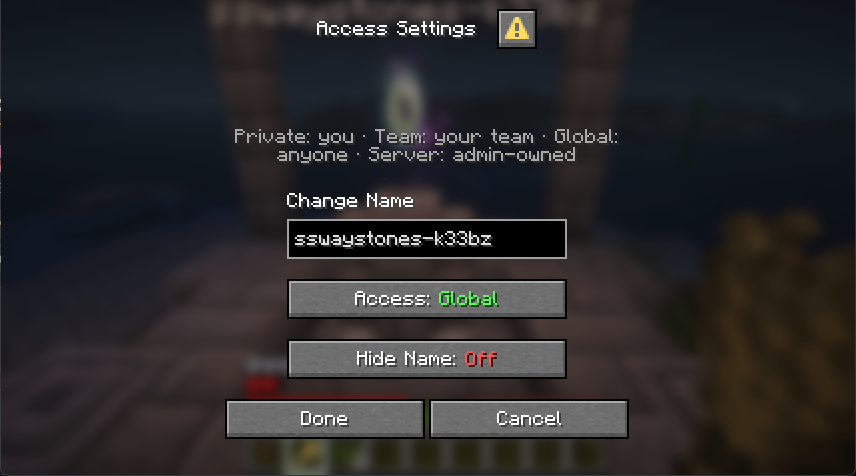

# Server-Side Waystones (k33bz fork)

A fork of [sylvxa/sswaystones](https://github.com/sylvxa/sswaystones), the Polymer-based server-side Waystone mod for Fabric. Vanilla and Bedrock (Geyser/Floodgate) clients can join without installing anything.

It is a drop-in replacement: same mod id, save data, config file and permissions. Upstream didn't want these changes ([PR #52](https://github.com/sylvxa/sswaystones/pull/52)), so they live here, and upstream fixes are merged in as they land.

## What the fork adds

- A native settings dialog for Java players. Set `settings_ui` to `dialog` and the Access Settings button opens one form with the name, the access level and Hide Name. The default `sgui` keeps the chest menus.

  

- One Access selector (Private, Team, Global, Server-owned) in the dialog and the Bedrock form instead of three toggles. The server checks the permissions again when the form is submitted.
- Hide Name, to turn off a waystone's floating name. Bedrock clients can read it through walls. Idea from [Hellscaped](https://github.com/sylvxa/sswaystones/pull/51).
- Global and server-owned waystones show a globe head in the viewer so public destinations stand out. An admin can give a server-owned waystone its own icon with `/waystonesettings icon`. Config `access_mode_icons` turns the globes off.
- Names in the viewer list are coloured by access, and team waystones use their team's colour.
- Only admins can edit server-owned waystones.
- Page arrows only when there is more than one page, and click hints on each entry.
- Translations for twelve more languages, checked against en_us by a unit test.
- `/waystonesettings testcreate | testopen <hash> | get <hash>` (admin) for scripted testing.

## Features (from upstream)

- Server-side Waystone blocks that allow you to teleport long distances and across dimensions.
- Feature-full GUIs for both Bedrock and Java players, using forms and chest GUIs respectively.
- Waystones can have up to 32 character long names and can be set to "global" to allow anybody on the server to use them.
- Works on both servers and singleplayer worlds; all storage data is held in the world itself.

## Recipes

*Recipe for the Waystone*

*Recipe for the Portable Waystone*

## Branches

| Branch | Minecraft |
|---|---|
| `main` | 26.3 |
| `26.2` | 26.2 |
| `26.1` | 26.1 |

Every push builds and runs the unit tests in [GitHub Actions](../../actions).

## Configuration

The file is saved in `config/sswaystones.json`, and can be edited either manually or by commands.

- `/sswaystones config set [key] [value]` (sets a configuration option)
- `/sswaystones config get [key]` (gets the value of a configuration option)
- `/sswaystones config help` (lists all configuration options)
- `/sswaystones config reload` (loads configuration from disk)
- `/sswaystones config save` (saves configuration to disk)

Fork options:

- `settings_ui`: `"sgui"` (default) or `"dialog"`.
- `access_mode_icons`: show the globe on global and server-owned waystones (default `true`).

On a public server, set `waystone_limit` (default `0`, unlimited). Every waystone is saved and listed in each viewer, so one player placing thousands bloats the save and the viewer for everyone. Server-owned waystones don't count toward the limit.

`paranoid_teleport` (default `true`) refuses a teleport when there is no safe spot beside the destination waystone. Teleporting never breaks or places blocks.

## Permissions

- `sswaystones.manager`: Allows the player to edit and steal *all* waystones. (requires op by default)
- `sswaystones.command`: Gives access to the /sswaystones command. (requires op by default)
- `sswaystones.create.place`: Allows the player to create waystones. (enabled by default)
- `sswaystones.create.global`: Allows the player to create "global" waystones. (enabled by default)
- `sswaystones.create.team`: Allows the player to create "team" waystones. (enabled by default)
- `sswaystones.create.server`: Allows the player to create and break "server-owned" waystones. (requires op by default)

## Contributing

Issues and pull requests are welcome. If a change isn't fork-specific, consider sending it [upstream](https://github.com/sylvxa/sswaystones) too.

### Translating

Shipped: en_us, zh_cn, zh_tw, ru_ru, es_es, es_mx, pt_br, de_de, ja_jp, fr_fr, fr_ca, ko_kr, pl_pl. Block names use each locale's official Minecraft wording. `TranslationsTest` fails the build when a shipped locale is missing a key, has an extra or blank one, or changes a `%s` placeholder or `§` code.

To add a language, create its file in `src/main/resources/data/sswaystones/lang` (the `data` folder, not `assets`), copy the keys from `en_us.json`, and add the locale to `TranslationsTest.LOCALES`. See the [Fabric Wiki](https://fabricmc.net/wiki/tutorial:lang) for how translations work.

## Credits and license

- [sylvie (sylvxa)](https://github.com/sylvxa) wrote sswaystones.
- [Hellscaped](https://github.com/Hellscaped) had the Hide Name idea (upstream PR #51).
- Inspired by the now-archived [Wraith Waystones Polymer Port](https://modrinth.com/mod/polymer-ports-waystones).

MIT, same as upstream.
